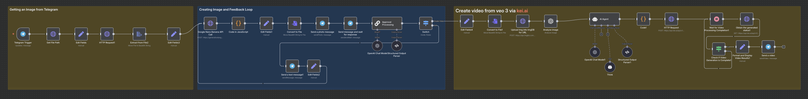

# AI Video Generator Workflow

# Architecture Overview

This automation pipeline processes user-uploaded images through multiple AI services to create professional video content:

1. **Input Processing** - Capture images and prompts via Telegram
   
3. **Image Enhancement** - Apply AI-powered edits using Google Nano Banana
   
5. **Interactive Feedback** - User approval system with re-editing capabilities
    
7. **Video Generation** - Convert enhanced images to videos using Veo3
   
9. **Content Delivery** - Automated distribution through Telegram

## Technical Stack

- **n8n** - Workflow orchestration and automation engine
  
- **Google Nano Banana (Gemini 2.5 Flash)** - Advanced image editing and enhancement
  
- **Veo3 Fast** - AI video generation via KIE.ai API
  
- **OpenAI GPT-4** - Prompt optimization and user intent processing
  
- **Telegram Bot API** - User interface and content delivery

- **ImageBB** - Image hosting and URL generation

## Workflow Architecture

### Core Components

#### 1. Telegram Integration

- Receives user images with text prompts
- Processes file uploads through Telegram API
- Extracts and converts images to Base64 format
- Maintains conversation context throughout the process

#### 2. Image Processing Pipeline

- **File Processing**: Converts Telegram images to processable formats
- **API Integration**: Interfaces with Google Nano Banana for image modifications
- **Base64 Handling**: Manages data encoding for API compatibility
- **Response Processing**: Extracts and formats AI-generated image data

#### 3. Interactive Approval System

- Presents edited images to users for review
- Implements structured decision flow:
  - **Approve**: Proceed to video generation
  - **Re-edit**: Return to image editing with new instructions
- Uses OpenAI for intelligent intent recognition
- Processes user feedback through structured output parsing

#### 4. Video Generation Engine

- **Image Analysis**: Uses GPT-4 Vision to create detailed scene descriptions
- **Prompt Engineering**: Converts user intent into cinematic video prompts
- **API Integration**: Interfaces with Veo3 through KIE.ai platform
- **Configuration**: 
  - Model: `veo3_fast`
  - Duration: 8 seconds
  - Aspect Ratio: 9:16 (mobile-optimized)
  - Quality: UGC-style with natural cinematography

#### 5. Processing Management

- **Asynchronous Handling**: Manages video generation wait times (30+ seconds)
- **Status Monitoring**: Polls generation status until completion
- **Error Handling**: Implements retry logic and failure management
- **Result Processing**: Formats and delivers final video content

## Business Applications

### Content Creation

- Social media video generation
- Marketing material automation
- Product demonstration videos
- Personalized content at scale

### Workflow Automation

- Reduces manual video editing time by 90%
- Enables non-technical users to create professional content
- Scales content production capabilities

## Setup Requirements

### API Credentials

- Google Cloud API key (Gemini 2.5 Flash access)
- OpenAI API key (GPT-4 access)
- KIE.ai API key (Veo3 access)
- Telegram Bot Token
- ImageBB API key

### Environment Configuration

- n8n instance (self-hosted or cloud)
- Webhook endpoints for Telegram integration
- Sufficient API quotas for processing volume
- Storage configuration for temporary files

## Performance Metrics

### Processing Times

- Image editing: 3-8 seconds
- Video generation: 30-320 seconds
- Total workflow: 3-6 minutes average

### Quality Standards

- Image enhancement: Production-ready output
- Video quality: HD with cinematic characteristics
- User satisfaction: High approval rates through feedback system

## Future Enhancements

### Platform Extensions

- WhatsApp integration for broader accessibility
- Slack workspace integration for team workflows
- Discord bot for community applications

### Technical Improvements

- Cloud storage integration (AWS S3, Google Cloud Storage)
- Advanced video customization options
- Batch processing capabilities
- Analytics and usage tracking

